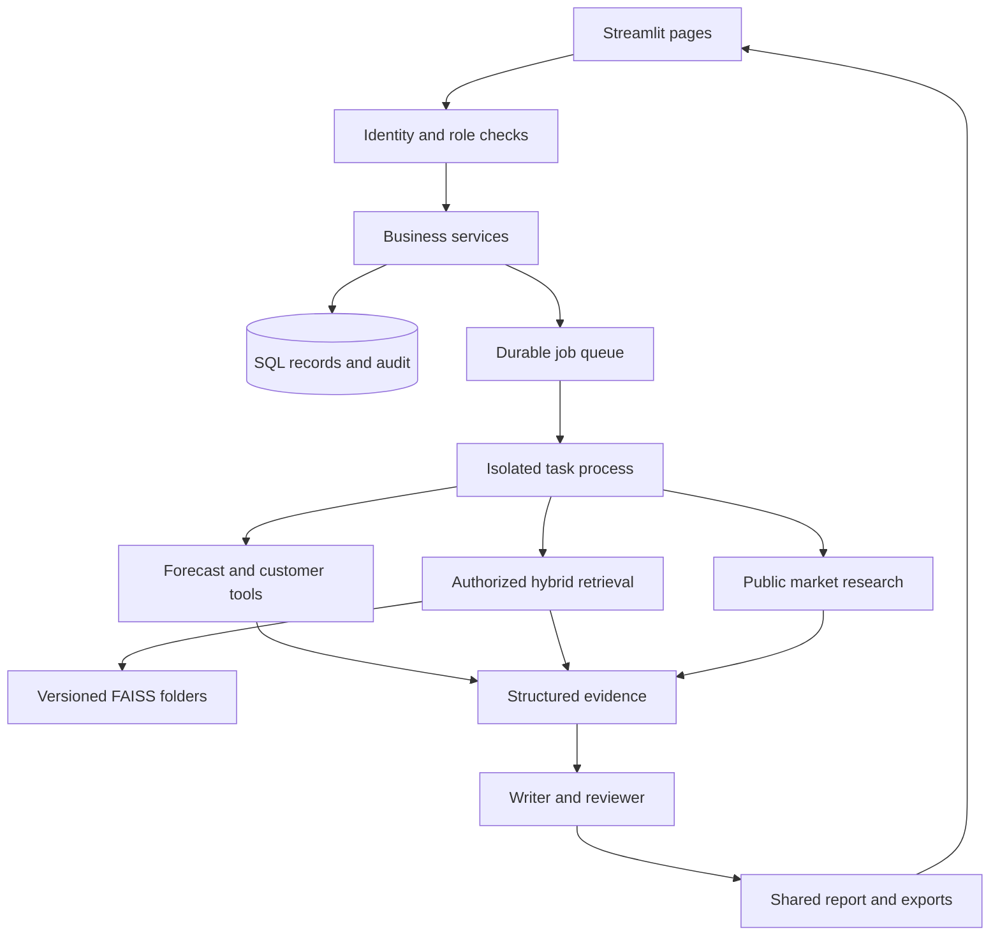
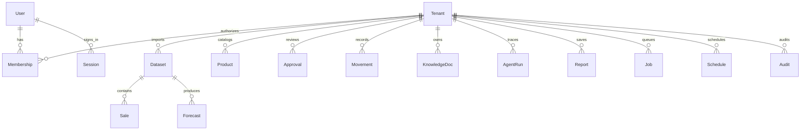

# Architecture and business rules

## Runtime

Streamlit owns interaction and presentation. Services accept an authenticated
`Context` and re-check current database membership before reading or changing data.
The LLM has no arbitrary Python, SQL, shell, file-system or browser tool. Provider
requests receive selected evidence, never database access. FastAPI is unnecessary
for this single UI; introduce it only when a POS/mobile client needs a separate API.

SQLite is a small local-development option; PostgreSQL is the shared-deployment
database. One application installation represents many isolated business workspaces,
with one store/currency per workspace. SQLAlchemy sessions are short transactions.
No customer data is cached globally by Streamlit. Cached resources are the worker
coordinator and model weights. Jobs execute in separate processes with hard deadlines.

## Files and interfaces

| Path | Responsibility and interface |
|---|---|
| `app.py` | Authenticated navigation, session boundary, page exception handling |
| `src/core/config.py` | Environment, safe storage paths and feature gates |
| `src/core/models.py`, `db.py` | SQL schema and transaction context |
| `src/core/auth.py` | Context, sessions, password/OIDC identity, live role checks |
| `src/services/data.py` | `read_file`, `normalize`, `import_sales`, `sales` |
| `src/analytics/forecasting.py` | Pure chronological fitting, scoring and prediction |
| `src/services/analytics.py` | Scoped model runs, finance and HR records |
| `src/services/inventory.py` | Inventory rules, purchase/price proposals and execution |
| `src/analytics/customers.py` | RFM, K-Means, two-item association rules, churn |
| `src/rag/extract.py` | Text/OCR extraction with source locations, chunking |
| `src/rag/retrieval.py` | Scope-first BM25/FAISS, manifests, fusion, reranking |
| `src/agents/pipeline.py` | Routing, evidence tools, Groq, deterministic review |
| `src/agents/crew.py` | Fresh writer/reviewer agents and typed CrewAI Flow |
| `src/agents/specs.py` | Agent responsibilities exposed in the application |
| `src/services/market.py` | DuckDuckGo search, safe page reads, catalog/pilot checks |
| `src/services/jobs.py` | Queue, atomic claim, schedules, process timeout/cancel |
| `src/services/reports.py` | Shared report object, authorized storage, seven exports |
| `src/services/lifecycle.py` | Source deletion and derived-artifact invalidation |
| `src/ui/pages/` | Separate Python module for every page |
| `migrations/` | Versioned Alembic schema changes |
| `tests/` | Integration, security, analytics, export and Streamlit checks |

## Data model

| Entity | Key fields / meaning |
|---|---|
| Tenant | UUID, name, currency, timezone, demo flag, external service consent |
| User / Membership | User identity and active role in a tenant; unique membership |
| Session / Invite | SHA-256 token digest and expiry; no raw token persisted |
| Dataset | Tenant, original filename/path, SHA-256 file hash, mapping/quality, zero-day decision |
| Sale | Dataset, business date, SKU, product, quantity, optional price/cost/customer/basket/stockout |
| Product | Tenant-unique SKU, name, category, stock, reservations, backorders, cost/price, pack/MOQ, supplier, lead/shelf assumptions |
| Movement | SKU, quantity delta, reason, timestamp; confirmed counts and receipts |
| Forecast | Dataset/SKU, model, horizon, dated predictions, folds/holdout, warnings |
| Approval | Exact payload hash, type, state, proposer, decision maker, note, decision deadline |
| Expense / Employee | Restricted finance or HR data, separate from public knowledge |
| KnowledgeDoc | Tenant, access collection, content hash, extracted segments/source locations |
| Research | Public query, evidence cards and retrieved times, saved/dismissed/snoozed state |
| AgentRun | Requester, question, tools/retrieval/stages, report and elapsed time |
| Report | Tenant, access scope, shared structured payload |
| Job / Schedule | Actor, type, payload, status, deadline/error, deduplication and next occurrence |
| Audit | Actor, timestamp, action and minimal IDs/metadata; not a full data dump |

Suppliers are currently product fields. Customer IDs are pseudonymous sale fields,
not a marketing directory. A transaction's item rows share date and transaction ID.
Purchase drafts are approvals; receipt creates a movement. Index chunks live in
protected versioned manifests. These deliberately compact structures can be split
into dedicated supplier, customer, order-line and chunk tables for a later POS API.

## Canonical import

Required: `date`, `sku`, `quantity`. Negative quantities represent returns.
`price` is the realized unit price after discount in the workspace currency;
`quantity` uses a consistent unit for each SKU. There is no currency/unit converter.
Use stable product IDs; identifier renames require explicit upstream reconciliation.
Dates should be local business dates; timezone conversion is not inferred.

| Feature | Additional data needed |
|---|---|
| Revenue | Realized unit price |
| Margin | Unit cost and price; incomplete costs suppress complete-profit claims |
| RFM / churn | Stable customer ID; monetary features also need price |
| Basket | Transaction ID for each sale line; date scopes reused IDs |
| Replenishment | Confirmed stock, lead time, pack, MOQ, costs, shelf assumptions |
| Pricing | Cost, current price, margin floor; demand response remains a scenario |

Each import preserves raw bytes and mapping/quality metadata. Invalid date, SKU or
numeric rows are rejected with reasons. Repeated-looking rows are counted, not
silently deleted. Identical raw files are blocked. Imports across files need owner
review for overlap. Forecasts select one dataset; dashboard/finance use all accepted
datasets. Missing periods require explicit confirmation before being filled with zero.
Closures are not automatically distinguished from lost records. Outliers remain
visible observations rather than being silently winsorized.

## Forecasting

Default: daily SKU series, at least 28 observations. Earlier chronological folds
select the default model by MAE; the final 7–14-day block is reserved for evaluation.
No random split is used. WAPE is null when actual total demand is zero. Bias is
predicted minus actual. Selected model is compared to seasonal naive on holdout.
After evaluation, fit all history and forecast 7, 14, 30 or 90 days.

Model choices are seasonal naive, 28-day moving average, Holt-Winters ETS,
ARIMA(1,1,1), Croston SBA, optional Prophet and optional Chronos-2. Chronos is an
initial Hugging Face candidate, not a measured winner for an unknown store. Optional
models are selected explicitly, so their latency is not imposed on every benchmark.
Heuristic intervals use held-out residual spread and a horizon adjustment. They
are labelled planning bands; statistical coverage is not calibrated. Promotions,
holidays, price elasticities and future covariates are not silently invented.

## Inventory formulas

Let d = daily demand, L = average lead days, σd = daily demand/residual standard
deviation, σL = lead-time standard deviation, z = desired service normal quantile,
S = ordering cost, C = unit landed cost, h = annual holding-rate fraction.

- Safety stock = z × √(L × σd² + d² × σL²), assuming independent uncertainty.
- ROP = d × L + safety stock.
- Inventory position = on hand + approved incoming − reservations − unreserved backorders.
- EOQ reference = √(2 × (365 × d) × S / (C × h)).
- Coverage = max(0, position) / d, undefined when d is zero.

Example: d=10 units/day, L=5 days, σd=3, σL=1 and 95% service (z≈1.645) gives
safety stock≈19.8 and ROP≈69.8 units. With on-hand 35, incoming 12, reservations 5
and backorders 2, position=40; review replenishment. C=100, h=0.20, S=500 gives
EOQ≈427 units. Shelf life, pack sizes, MOQ and available cash can make the actual
proposal much smaller; EOQ is not a command to buy 427 units.

Replenishment sorts urgent coverage first and allocates a shared budget. It caps
stock against expected shelf-life sales. Approved incoming stays included until
physical receipt, then becomes on-hand and leaves on-order, preventing double count.
Existing expiry dates appear in a seven-day review list. Storage-capacity and
multi-supplier optimization remain explicit extensions.

Price proposals enforce a chosen 5–80% margin floor range and positive cost. The
proposed price and cost are hashed and rechecked at approval/execution. This is
controlled pricing simulation, not an estimated causal demand curve. Purchase
execution records goods receipt; price execution updates only this app's catalog.

## Retrieval and agents

Metadata-first authorization precedes retrieval and reranking. Each collection has
its own FAISS directory, version pointer, manifest, embedding ID, dimension and
index checksum. BM25 preserves hyphenated SKUs. Reciprocal rank fusion combines
the first 30 lexical/dense hits, then a cross-encoder reranks up to 20 candidates.
The final context contains up to six located chunks. Stale or corrupt dense indexes
fall back to keyword evidence with an explicit note.

The orchestrator routes a question to one business domain. Private HR/finance
documents are included only for that domain, even for owners. Exact calculations
come from scoped services. Writer/reviewer agents receive read-only evidence.
Citation IDs and newly introduced numeric values are checked deterministically;
an LLM reviewer adds a second judgment, not proof of correctness. Failed drafts
fall back to evidence. No model-generated code executes.

See `docs/AGENTS.md` for the full agent contracts, permissions and review limits.
